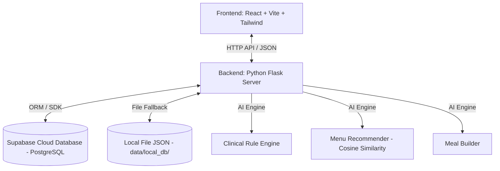
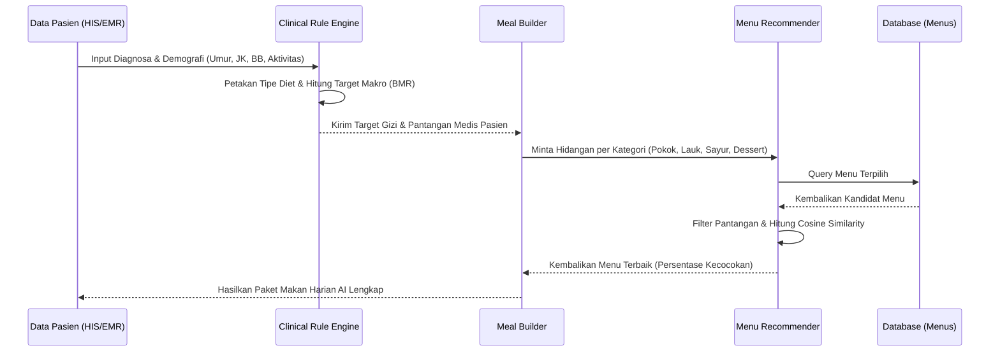
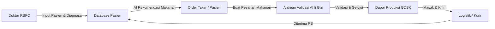

# LAPORAN TEKNIS: ARSITEKTUR & CARA KERJA SISTEM POS KATERING AI - RSPC

Laporan ini menyajikan deskripsi mendalam mengenai arsitektur, algoritma kecerdasan buatan (AI), alur kerja klinis, skema database, serta interaksi antar-komponen pada sistem **Point of Sale (POS) Katering Terintegrasi AI di Rumah Sakit President Center (RSPC)** yang didukung oleh **GDSK Catering Service**.

---

## 1. PENDAHULUAN & TUJUAN SISTEM

Sistem POS Katering AI RSPC dirancang untuk meminimalisasi kesalahan diet pasien rawat inap melalui integrasi otomatis antara catatan klinis rumah sakit dan dapur produksi katering. 
Sistem ini memecahkan tantangan kritis berikut:
* **Keamanan Klinis Pasien:** Menghindari penyajian makanan yang mengandung bahan pantangan/alergen pasien.
* **Personalisasi Gizi:** Menyesuaikan porsi dan nutrisi makro (Karbohidrat, Protein, Lemak, Kalori) berdasarkan umur, berat badan, jenis kelamin, dan diagnosa medis pasien secara presisi.
* **Efisiensi Logistik Katering:** Menghubungkan pesanan gizi secara *real-time* dari bangsal pasien ke dapur katering utama (GDSK) dan melacak pengiriman hingga tiba di rumah sakit.

---

## 2. ARSITEKTUR TEKNOLOGI (TECH STACK)

Sistem ini dibangun dengan arsitektur **Client-Server** modern yang terbagi menjadi tiga lapisan utama:



### A. Frontend Layer (React + Vite)
* **Pustaka Utama:** React 19.x, Vite, Tailwind CSS (untuk antarmuka responsif & berkinerja tinggi), serta Lucide React (ikonografi).
* **Komunikasi Data:** Menggunakan utilitas `fetchAPI` yang terpusat untuk komunikasi asinkron dengan Flask API.
* **Manajemen State:** Menggunakan React State Hooks (`useState`, `useEffect`) untuk pembaruan *dashboard real-time* secara periodik (auto-polling setiap 4 detik).

### B. Backend Layer (Python Flask API)
* **Framework:** Flask 3.1.3 dengan Flask-CORS untuk mendukung komunikasi lintas domain (CORS) selama pengembangan.
* **Pemrosesan Data:** Pandas dan NumPy untuk pembersihan dataset menu dan manipulasi matriks nutrisi pasien.
* **Model AI & Matriks:** Scikit-learn (`NearestNeighbors`, `StandardScaler`, `cosine_similarity`) untuk algoritma rekomendasi gizi berbasis kecocokan kosinus (Cosine Similarity).

### C. Database Layer (Dual-Mode Sync)
* **Database Cloud:** Supabase PostgreSQL Cloud Database sebagai basis data relasional produksi utama.
* **Local JSON Fallback:** Jika jaringan internet terputus atau kredensial Supabase kosong, sistem akan beralih secara otomatis (*failover*) ke penyimpanan file lokal `.json` di direktori `data/local_db/`.

---

## 3. ANALISIS FITUR & COMPONENT UTAMA (AI CORE)

Inti kecerdasan buatan pada backend sistem ini terbagi ke dalam tiga modul Python yang bekerja secara sekuensial:



### A. Modul 1: Clinical Rule Engine (`clinical_rules.py`)
Modul ini berfungsi sebagai penyaring klinis pertama yang membaca diagnosa medis pasien dan menerjemahkannya ke dalam aturan diet terapeutik serta batas kalori harian.

1. **Pemetaan Diagnosa Medis:** Membaca data dari berkas Excel `data/diet_mapping.xlsx` atau CSV `data/clinical_rules.csv` untuk memetakan diagnosa (seperti *Hipertensi*, *Diabetes Mellitus Tipe 2*, atau *CKD/Gagal Ginjal*) ke jenis diet yang sesuai (*Diet Rendah Natrium*, *Diet DM*, *Diet Rendah Protein*, dll.).
2. **Personalisasi Gizi (Target Kalori & Makronutrisi):** Jika berat badan, umur, jenis kelamin, dan tingkat stres aktivitas disediakan, sistem akan menghitung kebutuhan energi harian pasien secara dinamis:
   * **BMR (Basal Metabolic Rate):** Menggunakan rumus standar kebutuhan dasar berdasarkan rentang usia (Balita, Anak-anak, Dewasa, Lansia).
   * **Koreksi Aktivitas/Klinis:** Energi dikoreksi dengan faktor aktivitas fisik (sedentary, sedang, berat) dan stres klinis pasien.
   * **Distribusi Makro Harian:** Kalori target dipecah menjadi target gram Karbohidrat (50-60%), Protein (10-20%), dan Lemak (20-30%) sesuai pedoman gizi klinis.

---

### B. Modul 2: AI Menu Recommender (`recommendation.py`)
Modul ini bertugas mencari kecocokan terbaik antara target gizi pasien dan katalog menu GDSK menggunakan perhitungan matematis.

1. **Preprocessing Data Menu:**
   Katalog menu dibersihkan dari format mentah (`data/menu_fix.csv`), nilai nutrisi diubah ke tipe numerik, dan dikategorikan secara otomatis berdasarkan ekstraksi kata kunci nama makanan menjadi:
   * `pokok` (sumber karbohidrat utama seperti nasi, bubur, pasta)
   * `lauk_utama` (protein hewani utama seperti ayam, sapi, ikan, cumi)
   * `lauk_nabati` (protein sekunder tumbuh-tumbuhan seperti tahu, tempe)
   * `sayur` (tumisan sayuran, sup sayuran)
   * `dessert` (buah-buahan, camilan puding, kue basah)

2. **Penyaringan Blokir Klinis (Clinical Blocking):**
   * **Penyaringan Alergi & Pantangan Pasien:** Menggunakan peta sinonim lintas bahasa Inggris-Indonesia secara dinamis. Jika pasien pantang *"seafood"*, sistem otomatis memblokir menu dengan kata kunci *ikan, udang, cumi, kepiting, kerang, gurame*, dsb.
   * **Batas Mikronutrisi Ketat:**
     * *Diet Rendah Natrium/Hipertensi:* Memblokir makanan dengan kadar Natrium (Sodium) $> 150\text{ mg}$ per porsi.
     * *Diet DM/Diabetes:* Membatasi kadar Gula (Sugar) maksimal $5\text{ g}$ untuk menu umum, dan maksimal $15\text{ g}$ untuk buah-buahan segar alami.
     * *Diet Rendah Protein/Gagal Ginjal:* Memblokir menu dengan kadar Kalium (Potassium) $> 250\text{ mg}$ per porsi.
   * **Batas Makronutrisi Dinamis:** Mengevaluasi sisa anggaran kalori harian pasien agar menu terpilih tidak menyebabkan kelebihan gizi.

3. **Perhitungan Cosine Similarity:**
   Setelah candidates disaring dari pantangan klinis, keselarasan profil nutrisi (rasio keseimbangan nutrisi) dihitung.
   * Representasi vektor menu dan target gizi:
     $$\mathbf{A} = [ \text{Kalori}, \text{Protein}, \text{Lemak}, \text{Karbohidrat} ]$$
   * Vektor ini diskalakan menggunakan `StandardScaler` agar perbedaan skala antar-fitur (misalnya Kalori ratusan, Protein puluhan) tidak mendominasi perhitungan.
   * Nilai kecocokan dihitung dengan rumus kemiripan kosinus:
     $$\text{Similarity}(\mathbf{A}, \mathbf{B}) = \frac{\mathbf{A} \cdot \mathbf{B}}{\|\mathbf{A}\| \|\mathbf{B}\|}$$
   * Menu diurutkan berdasarkan skor kemiripan tertinggi (mendekati $1.00$ atau $100\%$) dan dikembangkan ke sistem.

---

### C. Modul 3: Daily Meal Builder (`meal_builder.py`)
Modul ini bertugas menyusun menu makan satu hari penuh (Breakfast, Lunch, Dinner) secara terstruktur.

1. **Distribusi Kalori & Makro per Waktu Makan:**
   Kebutuhan energi harian didistribusikan secara proporsional sesuai standar dietetika rumah sakit:
   * **Sarapan (Breakfast):** $25\%$ dari total kebutuhan gizi harian.
   * **Makan Siang (Lunch):** $40\%$ dari total kebutuhan gizi harian.
   * **Makan Malam (Dinner):** $35\%$ dari total kebutuhan gizi harian.

2. **Struktur Komposisi Hidangan:**
   * **Sarapan:** Terdiri dari makanan `pokok`, `lauk_utama`, `lauk_nabati`, dan `dessert` (tanpa sayur matang berat).
   * **Makan Siang & Makan Malam:** Menu lengkap 5 komponen (Makanan `pokok`, `lauk_utama`, `lauk_nabati`, `sayur`, dan `dessert`).
3. **Variasi Menu Dinamis:**
   Untuk mencegah pasien bosan dengan hidangan yang sama, modul ini memanggil top 5 rekomendasi teratas dari `MenuRecommender`, lalu mengambil satu item secara acak dari top 3 kandidat terbaik untuk disajikan ke dalam rencana hidangan harian.

---

## 4. ALUR KERJA PENGGUNA & DATA FLOW

Sistem ini mendukung 5 peran pengguna (*Roles*) yang terintegrasi dalam alur logistik makanan rumah sakit:



### A. Peran Dokter (Hospital Web Portal)
* **Aktivitas:** Menginput data demografi pasien baru serta diagnosa klinis saat pasien masuk perawatan inap.
* **Sistem:** Menyimpan profil pasien ke dalam database dan secara otomatis memicu `ClinicalRuleEngine` untuk menerbitkan aturan diet dasar pasien tersebut.

### B. Peran Order Taker / Pasien (Meal Selector)
* **Aktivitas:** Mengunjungi kamar pasien dan mencatat pesanan hidangan untuk hari esok.
* **Sistem:** 
  * Menawarkan opsi *"Pesan dengan Rencana AI"* (otomatis tersusun dalam 1 detik).
  * Menawarkan opsi *"Pesan Kustom"*, di mana petugas dapat memilih menu per kategori. Sistem memberikan **Peringatan Alergi secara Real-Time (Pop-up Merah)** jika menu kustom yang dipilih melanggar bahan pantangan medis pasien.

### C. Peran Ahli Gizi / Nutritionist (Clinical Approval)
* **Aktivitas:** Memeriksa seluruh antrean pesanan makanan pasien sebelum dikirim ke dapur.
* **Sistem:** Menampilkan detail kalori makanan yang dipesan versus kebutuhan target pasien. Ahli gizi mengevaluasi catatan peringatan klinis otomatis, lalu menekan tombol **"Validasi & Kirim ke Vendor GDSK"**.

### D. Peran Vendor Katering / Dapur GDSK (Food Production)
* **Aktivitas:** Melihat rekap kebutuhan hidangan harian yang harus dimasak berdasarkan order yang telah disetujui.
* **Sistem:** 
  * Mengelompokkan item menu yang harus dimasak hari ini.
  * Menyediakan tombol kontrol status produksi: `Diterima Dapur (Approved)` $\rightarrow$ `Sedang Dimasak (Diproduksi)` $\rightarrow$ `Sudah Dikirim ke RSPC (Dikirim)` $\rightarrow$ `Tiba & Diterima RS (Diterima)`.

### E. Peran Administrator AI (System Tuning & User Admin)
* **Aktivitas:** Memantau metrik kesehatan sistem, mengelola hak akses pengguna (menyetujui pendaftaran staf), dan melatih ulang model AI.
* **Sistem:** 
  * Menyediakan fitur **"Latih Ulang Model AI GDSK"** (Retrain Pipeline) jika terdapat penambahan menu makanan baru di file CSV utama.
  * Mengelola status aktivasi pengguna baru (fitur persetujuan konfirmasi akun).

---

## 5. SKEMA DATABASE RELASIONAL (`schema.sql`)

Struktur tabel di dalam database Supabase PostgreSQL dirancang agar kompatibel dengan model objek lokal JSON:

### A. Tabel `users`
Menyimpan data otentikasi staf rumah sakit dan vendor.
```sql
CREATE TABLE users (
    id VARCHAR(100) PRIMARY KEY,
    nama VARCHAR(255) NOT NULL,
    email VARCHAR(255) UNIQUE NOT NULL,
    role VARCHAR(50) NOT NULL, -- admin, doctor, nutritionist, order_taker, vendor
    vendor_id VARCHAR(50) NULL, -- V001, V002, V003 (Khusus role vendor)
    password VARCHAR(255) NOT NULL, -- Hashed dengan Werkzeug Security
    status_konfirmasi BOOLEAN DEFAULT FALSE,
    created_at TIMESTAMP WITH TIME ZONE DEFAULT CURRENT_TIMESTAMP
);
```

### B. Tabel `patients`
Menyimpan profil demografi dan profil target gizi klinis pasien.
```sql
CREATE TABLE patients (
    id VARCHAR(100) PRIMARY KEY,
    mrn VARCHAR(100) UNIQUE NOT NULL,
    nama VARCHAR(255) NOT NULL,
    umur INT NOT NULL,
    room_id VARCHAR(100) NOT NULL,
    diagnosa VARCHAR(255) DEFAULT 'Umum',
    alergi VARCHAR(255) DEFAULT '',
    berat_badan DECIMAL(5,2) NULL,
    tingkat_aktivitas VARCHAR(50) DEFAULT 'sedentary',
    jenis_kelamin VARCHAR(50) DEFAULT 'Laki-laki',
    diet VARCHAR(255) NOT NULL, -- Jenis diet terpetakan oleh AI
    kalori_target INT NOT NULL,
    protein_target INT NOT NULL,
    lemak_target INT NOT NULL,
    karbohidrat_target INT NOT NULL,
    pantangan TEXT DEFAULT '',
    catatan_klinis TEXT DEFAULT '',
    created_at TIMESTAMP WITH TIME ZONE DEFAULT CURRENT_TIMESTAMP
);
```

### C. Tabel `menus`
Menyimpan data hidangan katering GDSK beserta kandungan nutrisi detailnya.
```sql
CREATE TABLE menus (
    id SERIAL PRIMARY KEY,
    nama_menu VARCHAR(255) NOT NULL,
    kategori VARCHAR(50) NOT NULL, -- pokok, lauk_utama, lauk_nabati, sayur, dessert
    kalori_kcal DECIMAL(6,2) NOT NULL,
    protein_g DECIMAL(5,2) NOT NULL,
    lemak_g DECIMAL(5,2) NOT NULL,
    karbohidrat_g DECIMAL(5,2) NOT NULL,
    sodium_mg DECIMAL(6,2) DEFAULT 0.0,
    potassium_mg DECIMAL(6,2) DEFAULT 0.0,
    sugar_g DECIMAL(5,2) DEFAULT 0.0,
    bahan_makanan TEXT DEFAULT '',
    jenis_diet VARCHAR(255) NOT NULL,
    created_at TIMESTAMP WITH TIME ZONE DEFAULT CURRENT_TIMESTAMP
);
```

### D. Tabel `orders`
Menyimpan data pesanan hidangan dan riwayat status pengiriman logistik.
```sql
CREATE TABLE orders (
    id VARCHAR(100) PRIMARY KEY,
    patient_id VARCHAR(100) REFERENCES patients(id),
    patient_name VARCHAR(255) NOT NULL,
    patient_mrn VARCHAR(100) NOT NULL,
    patient_room VARCHAR(100) NOT NULL,
    items JSONB NOT NULL, -- Detail menu terpilih (Breakfast, Lunch, Dinner)
    status VARCHAR(50) DEFAULT 'Pending', -- Pending, Approved, Diproduksi, Dikirim, Diterima
    tanggal DATE NOT NULL,
    created_at TIMESTAMP WITH TIME ZONE DEFAULT CURRENT_TIMESTAMP
);
```

---

## 6. FITUR INTEGRASI HIS/EMR (INTEGRATION ENDPOINT)

Sistem ini menyediakan endpoint API khusus `/api/ai/recommend-instant` dan `/api/ai/recommend-clinical` yang berfungsi sebagai pintu gerbang (*gateway*) untuk integrasi dengan sistem rumah sakit eksternal seperti **HIS (Hospital Information System)** atau **EMR (Electronic Medical Record)**.

Melalui endpoint ini, sistem rumah sakit lain cukup mengirimkan data pasien mentah (nama, umur, jenis kelamin, diagnosa medis, alergi) dalam format POST JSON, dan API server RSPC akan langsung mengembalikan respon berupa rekomendasi lengkap rencana makanan gizi harian yang tervalidasi secara klinis dalam bentuk payload JSON.

---

## 7. RINGKASAN & KESIMPULAN

Sistem POS Katering AI RSPC ini menggabungkan prinsip kedokteran gizi klinis (*Clinical Rule Engine*) dengan optimasi komputasional (*Cosine Similarity*) untuk menjembatani operasional pelayanan gizi rumah sakit secara otomatis. Kehadiran sinkronisasi data Supabase PostgreSQL memastikan data tetap konsisten dan terdistribusi ke seluruh aktor sistem secara andal demi keselamatan pasien RSPC.
