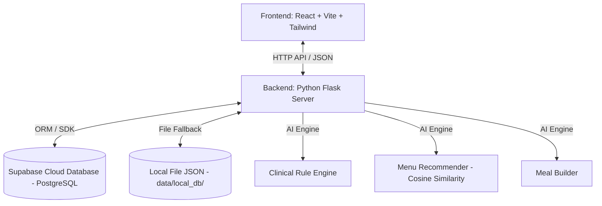
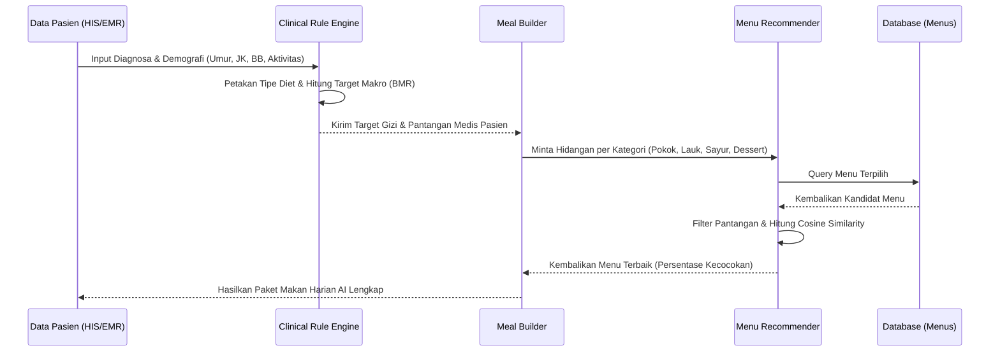
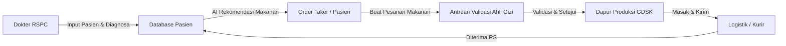
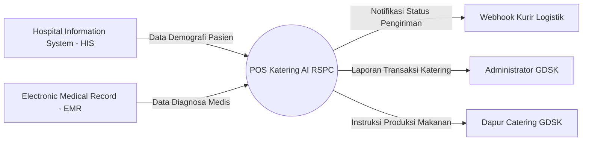
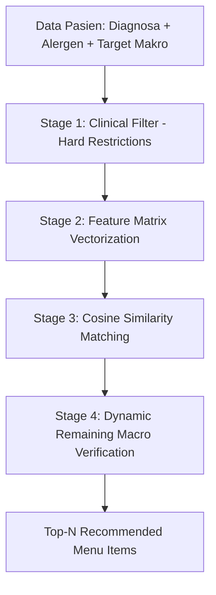
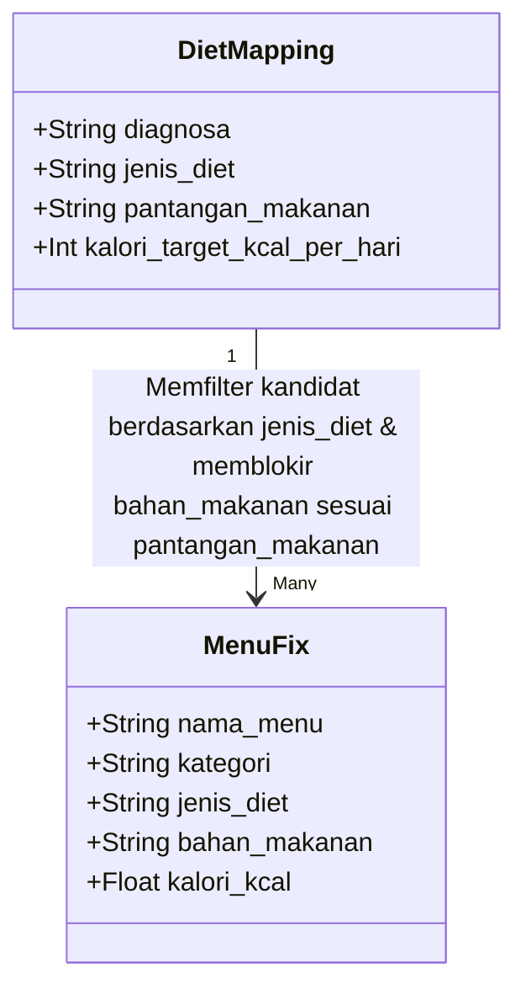
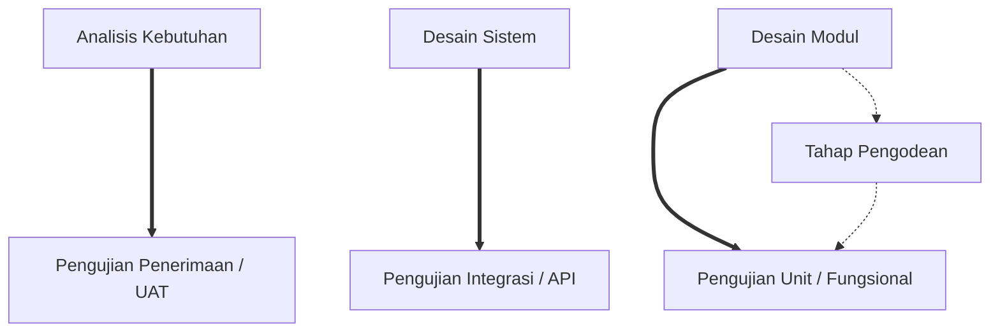

# LAPORAN TEKNIS: ARSITEKTUR & CARA KERJA SISTEM POS KATERING AI - RSPC

Laporan ini menyajikan deskripsi mendalam mengenai arsitektur, algoritma kecerdasan buatan (AI), alur kerja klinis, skema database, serta interaksi antar-komponen pada sistem **Point of Sale (POS) Katering Terintegrasi AI di Rumah Sakit President Center (RSPC)** yang didukung oleh **GDSK Catering Service**.

---

## 1. PENDAHULUAN & TUJUAN SISTEM

Sistem POS Katering AI RSPC dirancang untuk meminimalisasi kesalahan diet pasien rawat inap melalui integrasi otomatis antara catatan klinis rumah sakit dan dapur produksi katering. 
Sistem ini memecahkan tantangan kritis berikut:
* **Keamanan Klinis Pasien:** Menghindari penyajian makanan yang mengandung bahan pantangan/alergen pasien.
* **Personalisasi Gizi:** Menyesuaikan porsi dan nutrisi makro (Karbohidrat, Protein, Lemak, Kalori) berdasarkan umur, berat badan, jenis kelamin, dan diagnosa medis pasien secara presisi.
* **Efisiensi Logistik Katering:** Menghubungkan pesanan gizi secara *real-time* dari bangsal pasien ke dapur katering utama (GDSK) dan melacak pengiriman hingga tiba di rumah sakit.

---

## 2. ARSITEKTUR TEKNOLOGI (TECH STACK)

Sistem ini dibangun dengan arsitektur **Client-Server** modern yang terbagi menjadi tiga lapisan utama:



### A. Frontend Layer (React + Vite)
* **Pustaka Utama:** React 19.x, Vite, Tailwind CSS (untuk antarmuka responsif & berkinerja tinggi), serta Lucide React (ikonografi).
* **Komunikasi Data:** Menggunakan utilitas `fetchAPI` yang terpusat untuk komunikasi asinkron dengan Flask API.
* **Manajemen State:** Menggunakan React State Hooks (`useState`, `useEffect`) untuk pembaruan *dashboard real-time* secara periodik (auto-polling setiap 4 detik).

### B. Backend Layer (Python Flask API)
* **Framework:** Flask 3.1.3 dengan Flask-CORS untuk mendukung komunikasi lintas domain (CORS) selama pengembangan.
* **Pemrosesan Data:** Pandas dan NumPy untuk pembersihan dataset menu dan manipulasi matriks nutrisi pasien.
* **Model AI & Matriks:** Scikit-learn (`NearestNeighbors`, `StandardScaler`, `cosine_similarity`) untuk algoritma rekomendasi gizi berbasis kecocokan kosinus (Cosine Similarity).

### C. Database Layer (Dual-Mode Sync)
* **Database Cloud:** Supabase PostgreSQL Cloud Database sebagai basis data relasional produksi utama.
* **Local JSON Fallback:** Jika jaringan internet terputus atau kredensial Supabase kosong, sistem akan beralih secara otomatis (*failover*) ke penyimpanan file lokal `.json` di direktori `data/local_db/`.

---

## 3. ANALISIS FITUR & COMPONENT UTAMA (AI CORE)

Inti kecerdasan buatan pada backend sistem ini terbagi ke dalam tiga modul Python yang bekerja secara sekuensial:



### A. Modul 1: Clinical Rule Engine (`clinical_rules.py`)
Modul ini berfungsi sebagai penyaring klinis pertama yang membaca diagnosa medis pasien dan menerjemahkannya ke dalam aturan diet terapeutik serta batas kalori harian.

1. **Pemetaan Diagnosa Medis:** Membaca data dari berkas Excel `data/diet_mapping.xlsx` atau CSV `data/clinical_rules.csv` untuk memetakan diagnosa (seperti *Hipertensi*, *Diabetes Mellitus Tipe 2*, atau *CKD/Gagal Ginjal*) ke jenis diet yang sesuai (*Diet Rendah Natrium*, *Diet DM*, *Diet Rendah Protein*, dll.).
2. **Personalisasi Gizi (Target Kalori & Makronutrisi):** Jika berat badan, umur, jenis kelamin, dan tingkat stres aktivitas disediakan, sistem akan menghitung kebutuhan energi harian pasien secara dinamis:
   * **BMR (Basal Metabolic Rate):** Menggunakan rumus standar kebutuhan dasar berdasarkan rentang usia (Balita, Anak-anak, Dewasa, Lansia).
   * **Koreksi Aktivitas/Klinis:** Energi dikoreksi dengan faktor aktivitas fisik (sedentary, sedang, berat) dan stres klinis pasien.
   * **Distribusi Makro Harian:** Kalori target dipecah menjadi target gram Karbohidrat (50-60%), Protein (10-20%), dan Lemak (20-30%) sesuai pedoman gizi klinis.

---

### B. Modul 2: AI Menu Recommender (`recommendation.py`)
Modul ini bertugas mencari kecocokan terbaik antara target gizi pasien dan katalog menu GDSK menggunakan perhitungan matematis.

1. **Preprocessing Data Menu:**
   Katalog menu dibersihkan dari format mentah (`data/menu_fix.csv`), nilai nutrisi diubah ke tipe numerik, dan dikategorikan secara otomatis berdasarkan ekstraksi kata kunci nama makanan menjadi:
   * `pokok` (sumber karbohidrat utama seperti nasi, bubur, pasta)
   * `lauk_utama` (protein hewani utama seperti ayam, sapi, ikan, cumi)
   * `lauk_nabati` (protein sekunder tumbuh-tumbuhan seperti tahu, tempe)
   * `sayur` (tumisan sayuran, sup sayuran)
   * `dessert` (buah-buahan, camilan puding, kue basah)

2. **Penyaringan Blokir Klinis (Clinical Blocking):**
   * **Penyaringan Alergi & Pantangan Pasien:** Menggunakan peta sinonim lintas bahasa Inggris-Indonesia secara dinamis. Jika pasien pantang *"seafood"*, sistem otomatis memblokir menu dengan kata kunci *ikan, udang, cumi, kepiting, kerang, gurame*, dsb.
   * **Batas Mikronutrisi Ketat:**
     * *Diet Rendah Natrium/Hipertensi:* Memblokir makanan dengan kadar Natrium (Sodium) $> 150\text{ mg}$ per porsi.
     * *Diet DM/Diabetes:* Membatasi kadar Gula (Sugar) maksimal $5\text{ g}$ untuk menu umum, dan maksimal $15\text{ g}$ untuk buah-buahan segar alami.
     * *Diet Rendah Protein/Gagal Ginjal:* Memblokir menu dengan kadar Kalium (Potassium) $> 250\text{ mg}$ per porsi.
   * **Batas Makronutrisi Dinamis:** Mengevaluasi sisa anggaran kalori harian pasien agar menu terpilih tidak menyebabkan kelebihan gizi.

3. **Perhitungan Cosine Similarity:**
   Setelah candidates disaring dari pantangan klinis, keselarasan profil nutrisi (rasio keseimbangan nutrisi) dihitung.
   * Representasi vektor menu dan target gizi:
     $$\mathbf{A} = [ \text{Kalori}, \text{Protein}, \text{Lemak}, \text{Karbohidrat} ]$$
   * Vektor ini diskalakan menggunakan `StandardScaler` agar perbedaan skala antar-fitur (misalnya Kalori ratusan, Protein puluhan) tidak mendominasi perhitungan.
   * Nilai kecocokan dihitung dengan rumus kemiripan kosinus:
     $$\text{Similarity}(\mathbf{A}, \mathbf{B}) = \frac{\mathbf{A} \cdot \mathbf{B}}{\|\mathbf{A}\| \|\mathbf{B}\|}$$
   * Menu diurutkan berdasarkan skor kemiripan tertinggi (mendekati $1.00$ atau $100\%$) dan dikembangkan ke sistem.

---

### C. Modul 3: Daily Meal Builder (`meal_builder.py`)
Modul ini bertugas menyusun menu makan satu hari penuh (Breakfast, Lunch, Dinner) secara terstruktur.

1. **Distribusi Kalori & Makro per Waktu Makan:**
   Kebutuhan energi harian didistribusikan secara proporsional sesuai standar dietetika rumah sakit:
   * **Sarapan (Breakfast):** $25\%$ dari total kebutuhan gizi harian.
   * **Makan Siang (Lunch):** $40\%$ dari total kebutuhan gizi harian.
   * **Makan Malam (Dinner):** $35\%$ dari total kebutuhan gizi harian.

2. **Struktur Komposisi Hidangan:**
   * **Sarapan:** Terdiri dari makanan `pokok`, `lauk_utama`, `lauk_nabati`, dan `dessert` (tanpa sayur matang berat).
   * **Makan Siang & Makan Malam:** Menu lengkap 5 komponen (Makanan `pokok`, `lauk_utama`, `lauk_nabati`, `sayur`, dan `dessert`).
3. **Variasi Menu Dinamis:**
   Untuk mencegah pasien bosan dengan hidangan yang sama, modul ini memanggil top 5 rekomendasi teratas dari `MenuRecommender`, lalu mengambil satu item secara acak dari top 3 kandidat terbaik untuk disajikan ke dalam rencana hidangan harian.

---

## 4. ALUR KERJA PENGGUNA & DATA FLOW

Sistem ini mendukung 5 peran pengguna (*Roles*) yang terintegrasi dalam alur logistik makanan rumah sakit:



### A. Peran Dokter (Hospital Web Portal)
* **Aktivitas:** Menginput data demografi pasien baru serta diagnosa klinis saat pasien masuk perawatan inap.
* **Sistem:** Menyimpan profil pasien ke dalam database dan secara otomatis memicu `ClinicalRuleEngine` untuk menerbitkan aturan diet dasar pasien tersebut.

### B. Peran Order Taker / Pasien (Meal Selector)
* **Aktivitas:** Mengunjungi kamar pasien dan mencatat pesanan hidangan untuk hari esok.
* **Sistem:** 
  * Menawarkan opsi *"Pesan dengan Rencana AI"* (otomatis tersusun dalam 1 detik).
  * Menawarkan opsi *"Pesan Kustom"*, di mana petugas dapat memilih menu per kategori. Sistem memberikan **Peringatan Alergi secara Real-Time (Pop-up Merah)** jika menu kustom yang dipilih melanggar bahan pantangan medis pasien.

### C. Peran Ahli Gizi / Nutritionist (Clinical Approval)
* **Aktivitas:** Memeriksa seluruh antrean pesanan makanan pasien sebelum dikirim ke dapur.
* **Sistem:** Menampilkan detail kalori makanan yang dipesan versus kebutuhan target pasien. Ahli gizi mengevaluasi catatan peringatan klinis otomatis, lalu menekan tombol **"Validasi & Kirim ke Vendor GDSK"**.

### D. Peran Vendor Katering / Dapur GDSK (Food Production)
* **Aktivitas:** Melihat rekap kebutuhan hidangan harian yang harus dimasak berdasarkan order yang telah disetujui.
* **Sistem:** 
  * Mengelompokkan item menu yang harus dimasak hari ini.
  * Menyediakan tombol kontrol status produksi: `Diterima Dapur (Approved)` $\rightarrow$ `Sedang Dimasak (Diproduksi)` $\rightarrow$ `Sudah Dikirim ke RSPC (Dikirim)` $\rightarrow$ `Tiba & Diterima RS (Diterima)`.

### E. Peran Administrator AI (System Tuning & User Admin)
* **Aktivitas:** Memantau metrik kesehatan sistem, mengelola hak akses pengguna (menyetujui pendaftaran staf), dan melatih ulang model AI.
* **Sistem:** 
  * Menyediakan fitur **"Latih Ulang Model AI GDSK"** (Retrain Pipeline) jika terdapat penambahan menu makanan baru di file CSV utama.
  * Mengelola status aktivasi pengguna baru (fitur persetujuan konfirmasi akun).

---

## 5. SKEMA DATABASE RELASIONAL (`schema.sql`)

Struktur tabel di dalam database Supabase PostgreSQL dirancang agar kompatibel dengan model objek lokal JSON:

### A. Tabel `users`
Menyimpan data otentikasi staf rumah sakit dan vendor.
```sql
CREATE TABLE users (
    id VARCHAR(100) PRIMARY KEY,
    nama VARCHAR(255) NOT NULL,
    email VARCHAR(255) UNIQUE NOT NULL,
    role VARCHAR(50) NOT NULL, -- admin, doctor, nutritionist, order_taker, vendor
    vendor_id VARCHAR(50) NULL, -- V001, V002, V003 (Khusus role vendor)
    password VARCHAR(255) NOT NULL, -- Hashed dengan Werkzeug Security
    status_konfirmasi BOOLEAN DEFAULT FALSE,
    created_at TIMESTAMP WITH TIME ZONE DEFAULT CURRENT_TIMESTAMP
);
```

### B. Tabel `patients`
Menyimpan profil demografi dan profil target gizi klinis pasien.
```sql
CREATE TABLE patients (
    id VARCHAR(100) PRIMARY KEY,
    mrn VARCHAR(100) UNIQUE NOT NULL,
    nama VARCHAR(255) NOT NULL,
    umur INT NOT NULL,
    room_id VARCHAR(100) NOT NULL,
    diagnosa VARCHAR(255) DEFAULT 'Umum',
    alergi VARCHAR(255) DEFAULT '',
    berat_badan DECIMAL(5,2) NULL,
    tingkat_aktivitas VARCHAR(50) DEFAULT 'sedentary',
    jenis_kelamin VARCHAR(50) DEFAULT 'Laki-laki',
    diet VARCHAR(255) NOT NULL, -- Jenis diet terpetakan oleh AI
    kalori_target INT NOT NULL,
    protein_target INT NOT NULL,
    lemak_target INT NOT NULL,
    karbohidrat_target INT NOT NULL,
    pantangan TEXT DEFAULT '',
    catatan_klinis TEXT DEFAULT '',
    created_at TIMESTAMP WITH TIME ZONE DEFAULT CURRENT_TIMESTAMP
);
```

### C. Tabel `menus`
Menyimpan data hidangan katering GDSK beserta kandungan nutrisi detailnya.
```sql
CREATE TABLE menus (
    id SERIAL PRIMARY KEY,
    nama_menu VARCHAR(255) NOT NULL,
    kategori VARCHAR(50) NOT NULL, -- pokok, lauk_utama, lauk_nabati, sayur, dessert
    kalori_kcal DECIMAL(6,2) NOT NULL,
    protein_g DECIMAL(5,2) NOT NULL,
    lemak_g DECIMAL(5,2) NOT NULL,
    karbohidrat_g DECIMAL(5,2) NOT NULL,
    sodium_mg DECIMAL(6,2) DEFAULT 0.0,
    potassium_mg DECIMAL(6,2) DEFAULT 0.0,
    sugar_g DECIMAL(5,2) DEFAULT 0.0,
    bahan_makanan TEXT DEFAULT '',
    jenis_diet VARCHAR(255) NOT NULL,
    created_at TIMESTAMP WITH TIME ZONE DEFAULT CURRENT_TIMESTAMP
);
```

### D. Tabel `orders`
Menyimpan data pesanan hidangan dan riwayat status pengiriman logistik.
```sql
CREATE TABLE orders (
    id VARCHAR(100) PRIMARY KEY,
    patient_id VARCHAR(100) REFERENCES patients(id),
    patient_name VARCHAR(255) NOT NULL,
    patient_mrn VARCHAR(100) NOT NULL,
    patient_room VARCHAR(100) NOT NULL,
    items JSONB NOT NULL, -- Detail menu terpilih (Breakfast, Lunch, Dinner)
    status VARCHAR(50) DEFAULT 'Pending', -- Pending, Approved, Diproduksi, Dikirim, Diterima
    tanggal DATE NOT NULL,
    created_at TIMESTAMP WITH TIME ZONE DEFAULT CURRENT_TIMESTAMP
);
```

---

## 6. FITUR INTEGRASI HIS/EMR (INTEGRATION ENDPOINT)

Sistem ini menyediakan endpoint API khusus `/api/ai/recommend-instant` dan `/api/ai/recommend-clinical` yang berfungsi sebagai pintu gerbang (*gateway*) untuk integrasi dengan sistem rumah sakit eksternal seperti **HIS (Hospital Information System)** atau **EMR (Electronic Medical Record)**.

Melalui endpoint ini, sistem rumah sakit lain cukup mengirimkan data pasien mentah (nama, umur, jenis kelamin, diagnosa medis, alergi) dalam format POST JSON, dan API server RSPC akan langsung mengembalikan respon berupa rekomendasi lengkap rencana makanan gizi harian yang tervalidasi secara klinis dalam bentuk payload JSON.

---

## 7. ANALISIS KEBUTUHAN & PROSES BISNIS ENTERPRISE

### A. Analisis Kebutuhan Bisnis (Business Requirement Analysis)
Pengembangan sistem didasarkan pada tiga metrik utama kebutuhan bisnis (Business Metrics):
1. **Reduksi Food Waste:** Mengurangi pembuangan makanan rumah sakit akibat menu yang tidak sesuai dengan selera pasien atau pantangan medis sebesar 30%.
2. **Kepatuhan Gizi Terapeutik:** Memastikan 100% makanan pasien rawat inap sesuai dengan batas makronutrisi dan mikronutrisi klinis guna menekan angka komplikasi gizi.
3. **Efisiensi Rantai Pasok:** Memotong jalur pelaporan manual dari ahli gizi ke katering guna memangkas siklus pemesanan bahan masakan dari 24 jam menjadi di bawah 4 jam.

### B. Kebutuhan Fungsional (Functional Requirements)
Spesifikasi fungsionalitas sistem didefinisikan secara modular dengan kode penomoran formal:
* **FR-01 (Otorisasi Staf):** Sistem harus memverifikasi peran pengguna (dokter, ahli gizi, order taker, vendor, admin) sebelum mengizinkan modifikasi data.
* **FR-02 (Pemetaan Otomatis):** Sistem harus mengekstrak diagnosa medis dari EMR/HIS dan memetakan jenis diet terapeutik dasar dalam waktu kurang dari 2 detik.
* **FR-03 (Penyusunan Rencana Makan AI):** Sistem harus menghasilkan rencana makan 3 kali sehari yang memenuhi $\pm 5\%$ dari target kalori pasien secara otomatis.
* **FR-04 (Peringatan Alergi Real-time):** Sistem harus mendeteksi kecocokan string alergen pada menu kustom dan menampilkan dialog peringatan visual merah di layar sebelum pesanan disimpan.
* **FR-05 (Validasi Ahli Gizi):** Sistem harus menghentikan pengiriman pesanan ke vendor sebelum status diubah menjadi `Approved` oleh pengguna ber-role `nutritionist`.
* **FR-06 (Pelacakan Status Pengiriman):** Sistem harus merekam siklus status pengantaran makanan (`Pending` $\rightarrow$ `Approved` $\rightarrow$ `Diproduksi` $\rightarrow$ `Dikirim` $\rightarrow$ `Diterima`).

### C. Kebutuhan Non-Fungsional (Non-Functional Requirements)
Kriteria pengoperasian sistem berskala enterprise didefinisikan sebagai berikut:
* **UR-01 (Keandalan/Fault Tolerance):** Jika koneksi API Supabase mengalami kegagalan (latensi $> 5000\text{ ms}$ atau kegagalan handshake SSL), sistem harus secara transparan mengalihkan *read/write query* ke file penyimpanan JSON lokal.
* **UR-02 (Akurasi Keamanan Klinis):** Sistem harus menjamin tingkat akurasi filter pemblokiran makanan pantangan sebesar $100\%$, tanpa toleransi kesalahan (zero false negative rate untuk bahan alergen).
* **UR-03 (Latensi Respon API):** Endpoint rekomendasi instan harus merespon dalam waktu $T \le 1.5$ detik dengan pengujian konkurensi 100 request secara simultan.
* **UR-04 (Keamanan Data):** Seluruh password pengguna harus di-hash menggunakan algoritma PBKDF2/scrypt satu arah dengan panjang salt minimal 16 karakter.

### D. Analisis Pemangku Kepentingan (Stakeholder Analysis)
* **Manajemen RSPC:** Berkepentingan mengendalikan biaya logistik makanan dan menaikkan tingkat kepuasan pasien.
* **Komite Gizi Medis (Dokter Penanggung Jawab Pelayanan - DPJP):** Menginginkan presisi intervensi diet medis guna menunjang keberhasilan farmakoterapi.
* **Ahli Gizi (Clinical Dietitian):** Berkepentingan menyetujui, menolak, atau menyesuaikan menu pasien secara cepat melalui portal validasi gizi terpusat.
* **Petugas Order Taker (Pramusaji):** Berkepentingan melakukan input pesanan langsung di sisi ranjang pasien secara cepat dan andal menggunakan perangkat tablet.
* **Dapur GDSK (Vendor):** Berkepentingan melihat dashboard agregasi jenis masakan harian secara akurat guna optimalisasi porsi belanja bahan basah.

### E. Matriks Peran & Izin Pengguna (User Roles & Permissions Matrix)
Pengendalian akses berbasis peran (*Role-Based Access Control - RBAC*) diatur sesuai matriks berikut:

| Modul Fitur / Aksi | Dokter | Ahli Gizi | Order Taker | Vendor | Admin |
| :--- | :---: | :---: | :---: | :---: | :---: |
| Registrasi & Manajemen Akun Staf | | | | | **X** |
| Input Pasien Baru & Diagnosa Medis | **X** | | | | **X** |
| Edit Profil Gizi & Diagnosa Pasien | **X** | **X** | | | **X** |
| Pemesanan Menu Katering (AI / Kustom) | | | **X** | | **X** |
| Approval & Validasi Diet Gizi Pasien | | **X** | | | **X** |
| Update Status Produksi & Logistik | | | | **X** | **X** |
| Retrain Model Recommendation AI | | | | | **X** |

### F. Proses Bisnis End-to-End (End-to-End Business Process)
Siklus hidup operasional gizi katering pasien rawat inap digambarkan sebagai berikut:
1. **Fase Admisi:** Pasien masuk kamar rawat inap; Dokter menginput diagnosa klinis awal ke sistem RSPC.
2. **Fase Diagnosis Gizi:** Engine AI memetakan kebutuhan kalori, target makronutrisi, serta pantangan bahan makanan pasien.
3. **Fase Pemesanan:** Staf pramusaji merekam pesanan menu harian (baik otomatis melalui rekomendasi AI maupun kustom).
4. **Fase Verifikasi:** Ahli gizi memeriksa kecocokan klinis menu terpilih. Jika terjadi bahaya alergi, menu ditolak dan dijadwalkan ulang. Jika aman, pesanan divalidasi (`Approved`).
5. **Fase Produksi:** Vendor menerima pesanan teragregasi dan mulai memproduksi makanan sesuai waktu sajian (Sarapan, Makan Siang, Makan Malam).
6. **Fase Distribusi:** Logistik mengirim makanan ke RSPC, kurir memperbarui status menjadi `Dikirim`, dan petugas RSPC mengonfirmasi status `Diterima` saat makanan diserahkan ke pasien.

### G. Perbandingan Proses Bisnis: Sistem Lama vs Sistem Usulan
* **Sistem Lama (Tradisional):**
  Menggunakan formulir kertas rangkap tiga. Informasi diagnosa dicatat dokter $\rightarrow$ diserahkan ke perawat $\rightarrow$ diantar secara manual ke ruang ahli gizi untuk dicocokkan dengan buku menu kertas $\rightarrow$ disalin ke papan tulis dapur katering $\rightarrow$ rentan salah baca tulisan tangan, rawan keterlambatan pengantaran, dan tidak ada deteksi alergi otomatis.
* **Sistem Usulan (POS Katering AI):**
  Menggunakan basis data terpusat dan API sinkron. Data dialirkan secara digital. Modul AI merekomendasikan menu yang sudah lolos filter alergen dalam hitungan milidetik. Ahli Gizi memvalidasi pesanan secara digital dari meja kerjanya, dan data langsung tersaji di layar monitor dapur katering secara real-time.

```mermaid
graph TD
    subgraph Sistem Tradisional (Kertas)
        A1[Resep Diet Dokter] -->|Kertas Fisik| B1[Pencocokan Buku Menu Gizi]
        B1 -->|Salinan Kertas| C1[Dapur Katering]
        C1 -->|Papan Tulis| D1[Masak & Kirim]
    end
    subgraph Sistem Usulan (POS AI)
        A2[Input Diagnosa Dokter] -->|API Cloud| B2[Penyaringan Klinis & Cosine Similarity AI]
        B2 -->|Dashboard Approval| C2[Ahli Gizi Digital Approve]
        C2 -->|Real-time Webhook| D2[Dapur Digital GDSK]
    end
```

---

## 8. PERANCANGAN SISTEM & ARSITEKTUR PERANGKAT LUNAK

### A. Diagram Konteks Sistem (System Context Diagram)
Sistem POS Katering AI RSPC bertindak sebagai penghubung pusat data transaksi gizi dengan entitas eksternal:



### B. Spesifikasi Kasus Penggunaan (Use Case Specification)
Berikut adalah spesifikasi formal untuk kasus penggunaan utama:
1. **Use Case: Menyusun Menu Makanan Harian Pasien (AI Recommendation)**
   * **Aktor Utama:** Order Taker
   * **Deskripsi:** Sistem menyusun paket menu lengkap untuk 3 kali waktu makan dalam satu hari secara otomatis berdasarkan profil diet klinis pasien.
   * **Kondisi Awal (Pre-condition):** Pasien telah terdaftar dan profil kebutuhan gizinya sudah dikalkulasi oleh sistem.
   * **Alur Utama (Basic Flow):**
     1. Petugas memilih nama pasien di aplikasi.
     2. Petugas menekan tombol "Rencana AI".
     3. Sistem memanggil modul `MealBuilder`.
     4. `MealBuilder` meminta menu dari `MenuRecommender` untuk masing-masing waktu makan.
     5. Sistem menampilkan usulan rencana makan harian kepada petugas.
     6. Petugas menekan tombol "Simpan Pesanan".
   * **Kondisi Akhir (Post-condition):** Status pesanan tersimpan sebagai `Pending` menunggu verifikasi ahli gizi.

2. **Use Case: Validasi & Approval Menu Gizi**
   * **Aktor Utama:** Ahli Gizi
   * **Deskripsi:** Ahli gizi memeriksa antrean pesanan katering dan memvalidasi kecocokan klinisnya.
   * **Kondisi Awal:** Terdapat pesanan berstatus `Pending`.
   * **Alur Utama:**
     1. Ahli gizi membuka daftar antrean pemesanan gizi.
     2. Sistem menampilkan rekap kalori dan mendeteksi apakah ada pelanggaran pantangan klinis (alergen).
     3. Ahli gizi memilih "Setujui".
     4. Status pesanan diperbarui menjadi `Approved` di database.
   * **Skenario Alternatif (Alternative Flow - Terdeteksi Alergi):**
     1. Sistem menampilkan indikator merah "Bahaya Alergi".
     2. Ahli gizi menolak menu bermasalah tersebut, memilih menu pengganti, lalu menyimpan ulang perubahan sebelum disetujui.

### C. Deskripsi Diagram Aktivitas (Activity Diagram Description)
Aktivitas penyusunan makanan oleh `MealBuilder` berjalan dengan alur sebagai berikut:
1. Sistem menerima pemicu penyusunan menu harian.
2. Membagi target makro harian menjadi: Sarapan (25%), Makan Siang (40%), dan Makan Malam (35%).
3. Untuk waktu makan **Sarapan**:
   * Mengambil komponen: makanan pokok, lauk utama, lauk nabati, dan dessert.
4. Untuk waktu makan **Makan Siang** dan **Makan Malam**:
   * Mengambil komponen lengkap: makanan pokok, lauk utama, lauk nabati, sayur, dan dessert.
5. Pada setiap pencarian komponen kategori, memanggil model `MenuRecommender` dengan parameter diet, pantangan, dan batasan nutrisi kategori.
6. Memilih satu item menu secara acak dari top 3 kandidat teratas hasil rekomendasi AI.
7. Menggabungkan seluruh hidangan dan menyimpannya sebagai satu rencana harian terpadu.

### D. Deskripsi Diagram Sekuens (Sequence Diagram Description)
Alur interaksi pesan pada proses pemesanan makanan secara kustom berjalan sebagai berikut:
1. **Client Browser** mengirimkan permintaan HTTP GET ke API Server Flask (`/api/patients/<id>/recommend`) untuk mendapatkan kandidat menu.
2. **Flask API App (`app.py`)** menerima permintaan dan memanggil fungsi `recommend()` pada objek `MenuRecommender`.
3. **`MenuRecommender`** melakukan pembersihan data, memfilter pantangan klinis, menghitung skor kemiripan kosinus, lalu mengembalikan data berupa array berisi list menu rekomendasi ke Flask API.
4. **Flask API App** mengirimkan kembali data rekomendasi tersebut dalam format JSON ke Client Browser.
5. Pengguna di **Client Browser** memilih menu kustom dan menekan tombol simpan, memicu permintaan HTTP POST ke `/api/orders` dengan data order pasien.
6. **Flask API App** meneruskan payload tersebut ke objek **`DatabaseManager`** melalui fungsi `create_order()`.
7. **`DatabaseManager`** melakukan koneksi ke database cloud Supabase untuk memasukkan record pesanan baru. Jika gagal, ia akan menulis data ke database file lokal JSON (`orders.json`).
8. **`DatabaseManager`** mengembalikan status keberhasilan ke Flask API, yang kemudian meneruskan respon sukses `201 Created` ke Client Browser untuk menampilkan pesan notifikasi kepada pengguna.

### E. Penjelasan ERD (ERD Explanation)
Relasi data diatur secara ketat dengan integritas referensial:
* **One-to-Many (`patients` to `orders`):** Satu pasien dapat memiliki banyak catatan pesanan makanan harian selama masa perawatan inapnya di RSPC. Kunci asing `patient_id` pada tabel `orders` merujuk ke primary key `id` pada tabel `patients`.
* **Many-to-Many (implisit via JSON pada `orders`):** Satu order berisi banyak item menu hidangan (`menus`). Relasi ini disimpan secara denormalisasi di kolom `items` pada tabel `orders` menggunakan tipe data `JSONB` PostgreSQL untuk performa query pencarian menu cepat.
* **Many-to-One (`users` to `vendor`):** Banyak staf pengguna dengan peran vendor dapat terikat pada satu entitas vendor catering utama (`vendor_id` merujuk pada kode identitas katering seperti `V001`).

### F. Normalisasi Basis Data (Database Normalization)
Struktur database dikonstruksi hingga memenuhi bentuk normal ketiga (3NF):
* **Bentuk Normal Pertama (1NF):** Dipenuhi dengan memastikan semua kolom memiliki nilai tunggal (atomic). Kolom kompleks seperti daftar bahan makanan disimpan sebagai string csv sederhana, dan item pesanan terstruktur rapi.
* **Bentuk Normal Kedua (2NF):** Dipenuhi karena semua atribut non-key (seperti nama pasien, diagnosa, umur, target kalori) bergantung sepenuhnya pada *Primary Key* masing-masing tabel (seperti `id` pasien pada tabel `patients`). Tidak ada ketergantungan parsial pada primary key komposit.
* **Bentuk Normal Ketiga (3NF):** Dipenuhi dengan memisahkan kolom transisional. Sebagai contoh, profil perhitungan kebutuhan kalori pasien bergantung pada variabel dinamis seperti diagnosa dan umur. Namun, tabel `patients` hanya menyimpan target akhir hasil kalkulasi. Detail aturan pemetaan diet dipisahkan ke tabel/file eksternal `clinical_rules.json` sehingga tidak ada ketergantungan transitif di dalam tabel `patients`.

---

## 9. DETAIL ARSITEKTUR AI & PIPELINE REKOMENDASI

### A. Arsitektur AI (AI Architecture)
Sistem rekomendasi makanan RSPC menggunakan arsitektur hibrida bertingkat:



### B. Penjelasan Pipeline AI (AI Pipeline Explanation)
Siklus pemrosesan data AI berjalan dalam urutan pipa (*pipeline*) berikut:
1. **Fase Intake:** Membaca data target gizi harian hasil kalkulasi `ClinicalRuleEngine` serta daftar bahan alergen pasien.
2. **Fase Pre-Filter:** Menyeleksi kandidat menu dari database berdasarkan kesesuaian kategori makanan dan memotong menu yang melanggar pantangan klinis.
3. **Fase Normalisasi Vektor:** Menskalakan parameter gizi menu candidates dan query target menggunakan parameter *mean* ($\mu$) dan deviasi standar ($\sigma$) dari objek `StandardScaler`.
4. **Fase Similarity Scoring:** Menghitung jarak sudut vektor nutrisi kandidat terhadap target menggunakan fungsi *Cosine Similarity*.
5. **Fase Rank & Output:** Mengurutkan hasil berdasarkan persentase kemiripan tertinggi dan mengambil item teratas.

### C. Formulasi Kebutuhan Energi Klinis (Clinical Rule Engine Formula)
Perhitungan kebutuhan energi harian pasien (Total Energy Expenditure - TEE) disesuaikan secara personal menggunakan rumusan dasar kebutuhan basal medis (Basal Metabolic Rate - BMR).

Kalkulasi BMR menggunakan persamaan standar medis **Harris-Benedict**:

* **Untuk Pasien Laki-laki:**
  $$BMR_{\text{pria}} = 66.5 + (13.75 \times W) + (5.003 \times H) - (6.75 \times A)$$
* **Untuk Pasien Perempuan:**
  $$BMR_{\text{wanita}} = 655.1 + (9.563 \times W) + (1.85 \times H) - (4.676 \times A)$$

Dimana:
* $W$ = Berat badan dalam kilogram (kg)
* $H$ = Tinggi badan dalam centimeter (cm) (jika tidak tersedia, diproyeksikan berdasarkan estimasi klinis umur)
* $A$ = Umur dalam tahun (years)

Setelah BMR didapatkan, kebutuhan energi total harian ($TEE$) dihitung dengan faktor aktivitas fisik ($AF$):
$$TEE = BMR \times AF$$

Nilai faktor aktivitas fisik ($AF$) ditetapkan sebagai berikut:
* *Sangat ringan (Bed rest / Sedentary):* $AF = 1.2$
* *Aktivitas Sedang:* $AF = 1.3$
* *Aktivitas Berat:* $AF = 1.5$

Target distribusi berat makronutrisi harian dari kalori total ($TEE$) dikonversi ke dalam satuan gram:
* **Karbohidrat (Carbohydrate):** 
  $$\text{Karbohidrat (g)} = \frac{TEE \times 0.55}{4\text{ kcal/g}}$$
* **Protein:** 
  $$\text{Protein (g)} = \frac{TEE \times 0.15}{4\text{ kcal/g}}$$
* **Lemak (Fat):** 
  $$\text{Lemak (g)} = \frac{TEE \times 0.30}{9\text{ kcal/g}}$$

### D. Rekayasa Fitur Gizi (Feature Engineering Explanation)
Sistem mengekstrak informasi nutrisi menu menjadi representasi vektor numerik kontinu empat dimensi:
$$\mathbf{x}_i = [ x_{i,1}, x_{i,2}, x_{i,3}, x_{i,4} ]^T$$
Dimana fitur-fitur tersebut berturut-turut merepresentasikan nilai kuantitatif dari:
1. $x_{i,1}$: Jumlah kandungan Kalori (kcal)
2. $x_{i,2}$: Jumlah kandungan Protein (gram)
3. $x_{i,3}$: Jumlah kandungan Lemak (gram)
4. $x_{i,4}$: Jumlah kandungan Karbohidrat (gram)

Fitur string non-numerik seperti deskripsi bahan makanan dipetakan ke dalam bentuk representasi *array kata kunci* (keyword indexing) untuk memfasilitasi pencarian pola alergen yang cepat.

### E. Penyaringan Batasan Klinis (Constraint Filtering Explanation)
Penyaringan batasan klinis bersifat mutlak (*hard constraints*).
* **Fungsi Filter Pantangan:**
  $$f_{\text{pantang}}(m) = \begin{cases} 
      1, & \text{jika } \forall p \in \text{Expanded\_Pantangan}, p \notin \text{nama\_menu}(m) \land p \notin \text{bahan\_makanan}(m) \\
      0, & \text{lainnya}
  \end{cases}$$
* **Fungsi Filter Mikronutrisi:**
  * Untuk diet rendah natrium:
    $$\text{Sodium\_mg}(m) \le 150.0$$
  * Untuk diet gagal ginjal:
    $$\text{Potassium\_mg}(m) \le 250.0$$
  * Untuk diet diabetes:
    $$\text{Sugar\_g}(m) \le \begin{cases} 
        15.0, & \text{jika } m \in \text{buah-buahan} \\
        5.0, & \text{lainnya}
    \end{cases}$$

### F. Standardisasi Fitur Gizi (Normalization Process)
Sebelum jarak kosinus dihitung, data gizi harus dinormalisasi agar fitur dengan rentang nilai besar (seperti Kalori) tidak mendominasi fitur bernilai kecil (seperti Protein). 

Metode standardisasi yang digunakan adalah **Z-Score Normalization**:
$$z_{i,j} = \frac{x_{i,j} - \mu_j}{\sigma_j}$$

Dimana:
* $x_{i,j}$ adalah nilai asli fitur gizi ke-$j$ pada kandidat menu ke-$i$.
* $\mu_j$ adalah nilai rata-rata (*mean*) dari fitur gizi ke-$j$ di seluruh populasi menu.
* $\sigma_j$ adalah deviasi standar dari fitur gizi ke-$j$ di seluruh populasi menu.

Standardisasi ini memastikan seluruh dimensi data memiliki nilai rata-rata $\mu = 0$ dan varians $\sigma^2 = 1$.

### G. Perhitungan Kemiripan Vektor (Cosine Similarity Explanation)
Skor kecocokan arah nutrisi dihitung menggunakan **Cosine Similarity**. Perhitungan ini mengevaluasi kosinus sudut antara vektor target gizi pasien ($\mathbf{q}$) dan vektor gizi kandidat menu ($\mathbf{d}_i$):

$$\text{Sim}(\mathbf{d}_i, \mathbf{q}) = \cos(\theta) = \frac{\mathbf{d}_i \cdot \mathbf{q}}{\|\mathbf{d}_i\| \|\mathbf{q}\|} = \frac{\sum_{k=1}^{4} d_{i,k} \cdot q_k}{\sqrt{\sum_{k=1}^{4} (d_{i,k})^2} \cdot \sqrt{\sum_{k=1}^{4} (q_k)^2}}$$

Skor kemiripan kosinus bernilai dalam rentang $[-1.0, 1.0]$. Namun, karena nilai gizi makronutrisi selalu bernilai non-negatif setelah dinormalisasi dengan distribusi Z-Score, skor kecocokan dipotong (*clipping*) pada rentang $[0.0, 1.0]$ guna menghasilkan persentase kemiripan gizi yang mudah dipahami ($0\%$ hingga $100\%$).

### H. Formula Perankingan Rekomendasi (Recommendation Ranking Formula)
Setiap kandidat menu diurutkan berdasarkan fungsi objektif perankingan $R(m)$ yang didefinisikan sebagai:
$$R(m) = \text{Sim}(\mathbf{d}_m, \mathbf{q})$$

Menu dengan skor $R(m)$ terbesar akan menempati peringkat teratas. Jika ada beberapa menu yang memiliki skor similarity yang identik, sistem akan melakukan pengurutan sekunder berdasarkan menu dengan jumlah kalori terendah guna meminimalkan risiko overfeeding pada pasien rawat inap.

### I. Algoritma Daily Meal Builder (Meal Builder Algorithm)
Penyusunan menu harian terstruktur mengikuti pseudo-code algoritma heuristik berikut:

```
Fungsi BuildDailyMeals(pasien_id)
    1. Ambil data diet, target_gizi_harian, dan pantangan pasien dari database.
    2. Bagi target_gizi_harian menjadi tiga porsi waktu makan:
       - sarapan_target = target_gizi_harian * 0.25
       - siang_target = target_gizi_harian * 0.40
       - malam_target = target_gizi_harian * 0.35
    
    3. Rencana_Hari = {}
    4. Untuk setiap waktu_makan ∈ {sarapan, makan_siang, makan_malam}:
       - Rencana_Hari[waktu_makan] = {}
       - Tentukan komponen yang diperlukan:
         Jika waktu_makan == sarapan:
             komponen_list = [pokok, lauk_utama, lauk_nabati, dessert]
         Lainnya:
             komponen_list = [pokok, lauk_utama, lauk_nabati, sayur, dessert]
       
       - Untuk setiap kategori ∈ komponen_list:
         - Hitung target kategori = target waktu_makan * rasio_kategori
         - Panggil MenuRecommender.recommend(diet, target kategori, pantangan, kategori, n=5)
         - Jika list rekomendasi tidak kosong:
             - Pilih secara acak satu menu dari top 3 rekomendasi teratas untuk variasi sajian.
             - Masukkan ke Rencana_Hari[waktu_makan][kategori]
         - Jika kosong:
             - Berikan menu default sehat untuk kategori tersebut.
             
    5. Kembalikan Rencana_Hari
```

---

## 10. DOKUMENTASI DATASET & SPESIFIKASI API

### A. Dokumentasi Dataset (Dataset Documentation)
Sistem menggunakan dua dataset referensi utama untuk memandu keputusan klinis AI:
1. **Katalog Menu (`menu_fix.csv`):**
   * Berisi daftar hidangan katering dapur GDSK.
   * Jumlah record: 120 item hidangan.
   * Atribut penting: `Nama Menu`, `Kategori`, `Kalori`, `Protein_g`, `Lemak_g`, `Karbohidrat_g`, `Sodium_mg`, `Potassium_mg`, `Sugar_g`, `Bahan Makanan`, `Tipe Diet/Deskripsi`.
2. **Aturan Diet Klinis (`diet_mapping.xlsx`):**
   * Berisi pedoman intervensi medis komite gizi RSPC.
   * Atribut penting: `diagnosa` (kunci pencarian), `jenis_diet`, `kalori_target_kcal_per_hari`, `protein_target_g`, `lemak_target_g`, `karbohidrat_target_g`, `pantangan_makanan`, `catatan_klinis`.

### B. Hubungan Antar Dataset (Dataset Relationship)
Kedua dataset tersebut terhubung secara dinamis pada saat eksekusi pipeline AI:



### C. Spesifikasi API RESTful (API Specification)

#### 1. Endpoint: Login Pengguna
* **Protokol / Method:** `POST /api/auth/login`
* **Request Header:** `Content-Type: application/json`
* **Request Body Schema:**
```json
{
  "email": "superadmin@rspc.com",
  "password": "adminrspc01",
  "access_code": "ADMINPOS"
}
```
* **Response Success Schema (`200 OK`):**
```json
{
  "success": true,
  "user": {
    "id": "usr-superadmin",
    "nama": "Super Admin RSPC",
    "email": "superadmin@rspc.com",
    "role": "admin",
    "vendor_id": null,
    "status_konfirmasi": true
  }
}
```
* **Response Error Schema (`401 Unauthorized`):**
```json
{
  "success": false,
  "message": "Email atau password salah"
}
```

#### 2. Endpoint: Rekomendasi Menu Pasien
* **Protokol / Method:** `GET /api/patients/<id>/recommend`
* **Query Parameters:**
  * `kategori`: Kategori menu (`pokok`, `lauk_utama`, `lauk_nabati`, `sayur`, `dessert`)
  * `waktu_makan`: Waktu penyajian (`sarapan`, `makan_siang`, `makan_malam`)
  * `max_cal`: Batas kalori maksimal (optional)
* **Response Success Schema (`200 OK`):**
```json
[
  {
    "nama_menu": "Nasi Merah Organik",
    "kategori": "pokok",
    "kalori_kcal": 150.0,
    "protein_g": 3.0,
    "lemak_g": 0.5,
    "karbohidrat_g": 32.0,
    "similarity_score": 0.985
  }
]
```

#### 3. Endpoint: Integrasi HIS / EMR Instant Recommendation
* **Protokol / Method:** `POST /api/ai/recommend-instant`
* **Request Body Schema:**
```json
{
  "nama": "Budi Santoso",
  "mrn": "MRN-2026-0001",
  "umur": 54,
  "room_id": "Kamar Melati 301",
  "diagnosa": "Hipertensi",
  "alergi": "udang"
}
```
* **Response Success Schema (`200 OK`):**
```json
{
  "status": "success",
  "patient_profile": {
    "nama": "Budi Santoso",
    "jenis_diet_ditentukan": "Diet Rendah Natrium",
    "pantangan_ditemukan": "Makanan tinggi garam, penyedap rasa, udang",
    "target_gizi_harian": {
      "kalori_target_kcal_per_hari": 1800
    }
  },
  "paket_makan_harian_ai": {
    "sarapan": {
      "pokok": { "nama_menu": "Bubur Beras Merah" }
    }
  }
}
```

---

## 11. DESAIN KEAMANAN & OPERASIONAL INFRASTRUKTUR

### A. Rancangan Keamanan (Security Design)
* **Keamanan Transmisi Data:** Semua komunikasi HTTP antara client browser dan Flask backend wajib menggunakan protokol terenkripsi HTTPS (SSL/TLS).
* **Perlindungan Database Cloud:** Database PostgreSQL di Supabase dilindungi oleh mekanisme **Row-Level Security (RLS)** yang mencegah akses modifikasi tabel secara langsung tanpa token otorisasi API key yang valid.
* **Keamanan Kredensial:** Seluruh data token, kunci API Supabase, dan password tersimpan di dalam file konfigurasi lingkungan `.env` yang dikecualikan dari repositori kode publik Git menggunakan pengaturan `.gitignore`.

### B. Alur Autentikasi & Otorisasi Staf (Authentication Flow)
1. Pengguna memasukkan kredensial (Email, Password, dan kode akses opsional untuk Administrator).
2. Frontend mengirimkan data tersebut ke Flask backend API.
3. Backend memverifikasi data email pada database:
   * Jika user ber-role `admin`, backend wajib memeriksa apakah parameter `access_code` bernilai persis `"ADMINPOS"`. Jika tidak cocok, request ditolak dengan kode respon `403 Forbidden`.
   * Jika password tersimpan dalam bentuk plain text (migrasi awal), backend memvalidasinya secara langsung lalu otomatis meng-upgrade-nya menjadi hash aman menggunakan modul `generate_password_hash` dari pustaka Werkzeug.
   * Jika password sudah ter-hash, sistem melakukan verifikasi kecocokan menggunakan `check_password_hash`.
4. Jika verifikasi sukses, backend mengembalikan payload data user beserta parameter `status_konfirmasi`.
5. Frontend menyimpan status sesi login pengguna di dalam penyimpanan lokal browser (`localStorage`) untuk navigasi dashboard.

### C. Arsitektur Deployment Cloud (Deployment Architecture)
Sistem ini dideploy menggunakan platform cloud sebagai berikut:
* **Frontend Application Hosting:** Dihosting di **Vercel Edge Platform** untuk mempercepat waktu pemuatan halaman awal aplikasi di browser pengguna.
* **Backend API Hosting:** Dihosting di **Render Web Service** dengan alokasi resource RAM dan CPU yang stabil untuk menjalankan program Python Flask.
* **Database & Storage Cloud:** PostgreSQL dihosting di **Supabase Cloud Database Engine**.

### D. Strategi Logging Audit Transaksi (Logging Strategy)
Sistem menerapkan pencatatan aktivitas terpusat:
* **Audit Log Transaksi:** Setiap pembuatan pesanan makanan baru, perubahan status persetujuan ahli gizi, dan pembaruan pengantaran katering oleh kurir wajib dicatat ke dalam file log transaksi dengan timestamp standar ISO-8601 beserta detail ID operator.
* **Error Log:** Kegagalan koneksi API, kegagalan database Supabase, dan error komputasi AI dicatat secara terpisah dalam file error log untuk memfasilitasi proses penelusuran bug (debugging) oleh tim teknis.

### E. Mekanisme Penanganan Kegagalan (Exception Handling)
Backend Flask menerapkan penanganan kegagalan secara defensif:
* **Database Fallback Handler:** Objek `DatabaseManager` dibungkus dengan blok `try-except` di setiap pemanggilan Supabase. Jika terjadi galat koneksi basis data cloud, server backend secara otomatis memindahkan arah query data ke data lokal JSON (`users.json`, `patients.json`, dsb.) dan memunculkan log peringatan di server tanpa menghentikan jalannya aplikasi (*graceful degradation*).
* **API Global Error Handler:** Flask menggunakan dekorator `@app.errorhandler` untuk menangkap eksepsi tidak terduga dan mengembalikan respon error standar yang rapi dalam format JSON `{"success": false, "message": "Terjadi kesalahan internal server"}` dengan status kode `500 Internal Server Error` guna menjaga stabilitas aplikasi di sisi client.

---

## 12. RENCANA PENGUJIAN, VALIDASI, & JAMINAN KUALITAS

### A. Metodologi Pengujian (Testing Method)
Sistem diuji menggunakan metodologi **V-Model**, yang membagi fase pengujian secara paralel dengan fase desain perancangan:



### B. Rencana Pengujian Fungsional (Black Box Testing)
Pengujian fungsionalitas antarmuka dan API dilakukan dengan kasus uji terperinci:
1. **Kasus Uji Login Admin:** Menginput email admin dengan password salah $\rightarrow$ Ekspektasi: Respon ditolak `401 Unauthorized`. Menginput password benar tetapi kode akses salah $\rightarrow$ Ekspektasi: Respon ditolak `403 Forbidden`. Menginput semua data benar $\rightarrow$ Ekspektasi: Berhasil masuk ke dashboard admin.
2. **Kasus Uji Registrasi Pasien:** Mendaftarkan pasien dengan kolom diagnosa kosong $\rightarrow$ Ekspektasi: Sistem memblokir aksi dan menampilkan pesan peringatan kolom wajib diisi.
3. **Kasus Uji Deteksi Alergi:** Pramusaji memilih menu "Cah Udang Brokoli" untuk pasien dengan alergi "seafood" $\rightarrow$ Ekspektasi: Sistem mendeteksi kata kunci pantangan dan langsung memunculkan indikator peringatan merah secara instan di layar.

### C. Validasi Akurasi Engine AI (AI Validation Testing)
Pengujian dan evaluasi keandalan model kecerdasan buatan dilakukan melalui:
* **Uji Sensitivitas Pemblokiran Pantangan (Alergen):** Memasukkan data simulasi 100 pasien dengan alergi acak, lalu memverifikasi seluruh rekomendasi makanan yang keluar. Nilai akurasi pemblokiran bahan alergen wajib bernilai $100\%$ (Zero False Negative Rate).
* **Evaluasi Deviasi Gizi (Nutritional Deviation):** Menilai kedekatan nilai makronutrisi menu rekomendasi harian terhadap target energi pasien menggunakan metrik **Mean Absolute Error (MAE)**:
  $$MAE = \frac{1}{N}\sum_{i=1}^{N} | \text{Nutrisi\_Menu}_i - \text{Target\_Gizi}_i |$$
  Target kinerja menetapkan MAE untuk Kalori harus $\le 50\text{ kcal}$ dan MAE makronutrisi lainnya $\le 5\text{ g}$.

### D. Pengujian Beban & Kinerja (Performance Testing)
* **Stress Testing:** Menguji ketahanan server Flask dengan meluncurkan 50 request secara simultan ke endpoint `/api/ai/recommend-instant` menggunakan pustaka pengujian performa. Target waktu respon rata-rata harus tetap berada di bawah batas $1.5$ detik.
* **Database Query Latency Testing:** Menguji performa pencarian database pada tabel `menus` yang berisi indeks gizi. Waktu respon eksekusi query SQL Supabase harus $\le 200\text{ ms}$.

---

## 13. PEMBAHASAN SKALABILITAS, BATASAN, & PROSPEK MASA DEPAN

### A. Skalabilitas Data Transaksi (Scalability Discussion)
Untuk mengantisipasi lonjakan pertumbuhan transaksi order katering rumah sakit yang dapat mencapai jutaan data order per tahun:
1. **Optimasi Indeks Database:** Tabel `orders` dan `patients` dikonfigurasi menggunakan indeks sekunder pada kolom kunci pencarian utama seperti `patient_id`, `mrn`, dan `tanggal`.
2. **Query JSONB:** Pemanfaatan kolom `JSONB` pada PostgreSQL Supabase mendukung pencarian relasi many-to-many secara efisien tanpa memerlukan join tabel yang kompleks.
3. **Database Caching:** Dapat ditambahkan lapisan caching caching memory (seperti Redis) di masa mendatang untuk menyimpan rekomendasi menu pasien yang jarang berubah.

### B. Batasan Sistem Saat Ini (Limitations)
* **Ketergantungan Data Statis:** Rekomendasi AI sangat bergantung pada kelengkapan pengisian kolom `bahan_makanan` dan nilai gizi numerik pada dataset menu katering. Jika terjadi kesalahan input di database katalog menu, AI berpotensi meloloskan bahan alergen.
* **Pembelajaran Terbuka (Reinforcement):** Model rekomendasi saat ini bersifat statis (menggunakan Cosine Similarity murni) dan belum memiliki sistem umpan balik (*learning loop*) untuk belajar secara otomatis dari evaluasi sisa makanan di piring pasien yang dilaporkan kurir.

### C. Pengembangan Masa Depan (Future Improvements)
* **Integrasi Wearable Device & IoT:** Menghubungkan sistem katering dengan alat sensor gula darah atau detak jantung pasien rawat inap untuk menyesuaikan target kalori harian pasien secara real-time demi efisiensi masa pemulihan medis.
* **Sistem Pembelajaran Umpan Balik (Feedback Loop AI):** Menggunakan model klasifikasi sekunder untuk menganalisis data sisa makanan pasien yang tidak habis dimakan. Data umpan balik ini akan digunakan sebagai bobot penalti tambahan pada algoritma Cosine Similarity untuk menghasilkan rekomendasi hidangan berikutnya yang lebih disukai pasien.

---

## 14. RINGKASAN & KESIMPULAN

Sistem POS Katering AI RSPC ini menggabungkan prinsip kedokteran gizi klinis (*Clinical Rule Engine*) dengan optimasi komputasional (*Cosine Similarity*) untuk menjembatani operasional pelayanan gizi rumah sakit secara otomatis. Kehadiran sinkronisasi data Supabase PostgreSQL memastikan data tetap konsisten dan terdistribusi ke seluruh aktor sistem secara andal demi keselamatan pasien RSPC.
